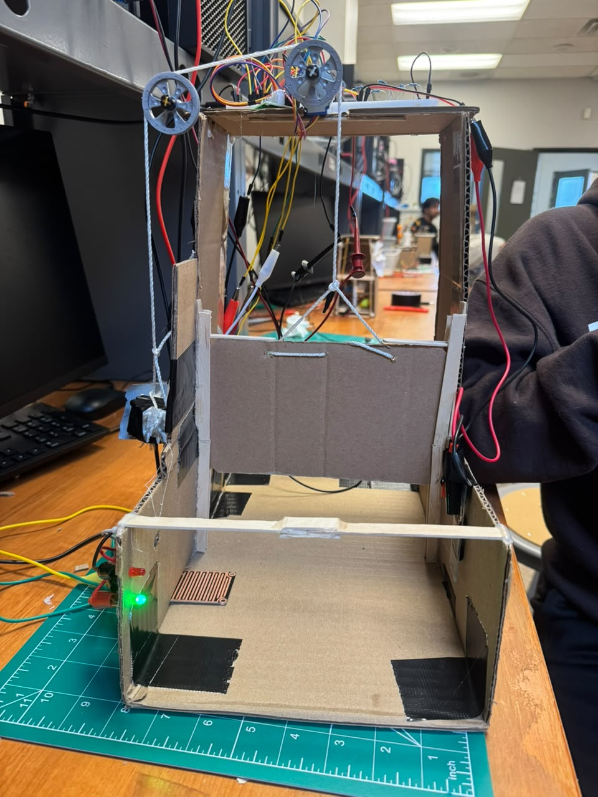
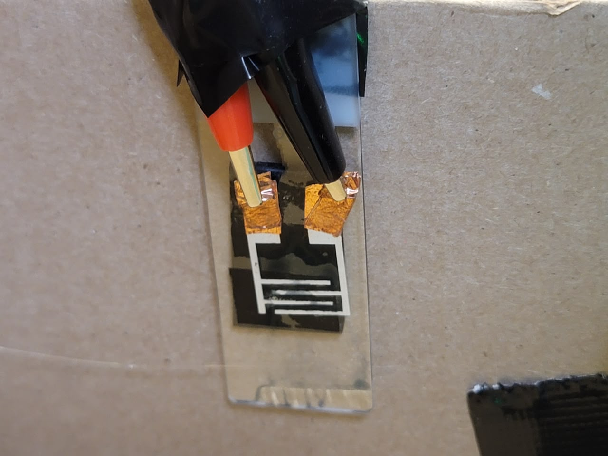
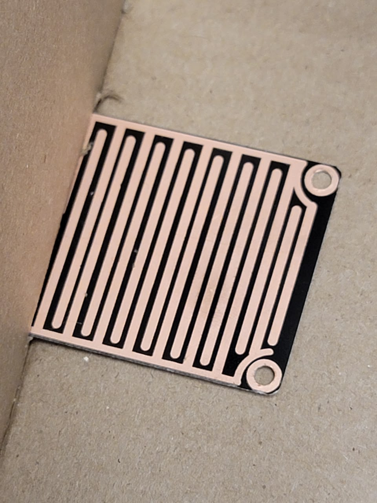
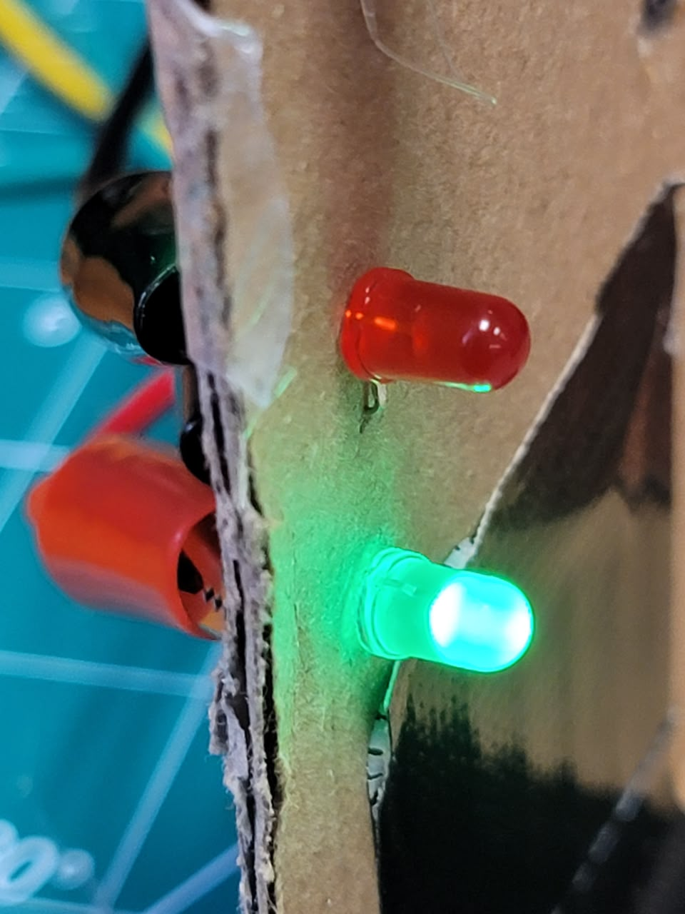
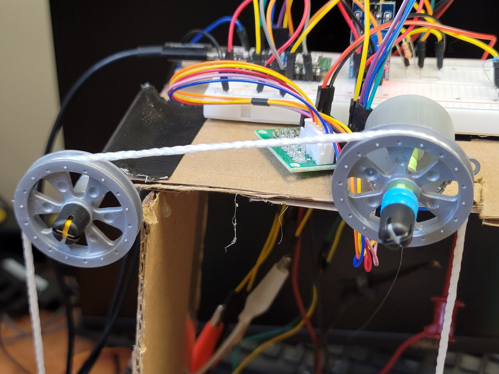
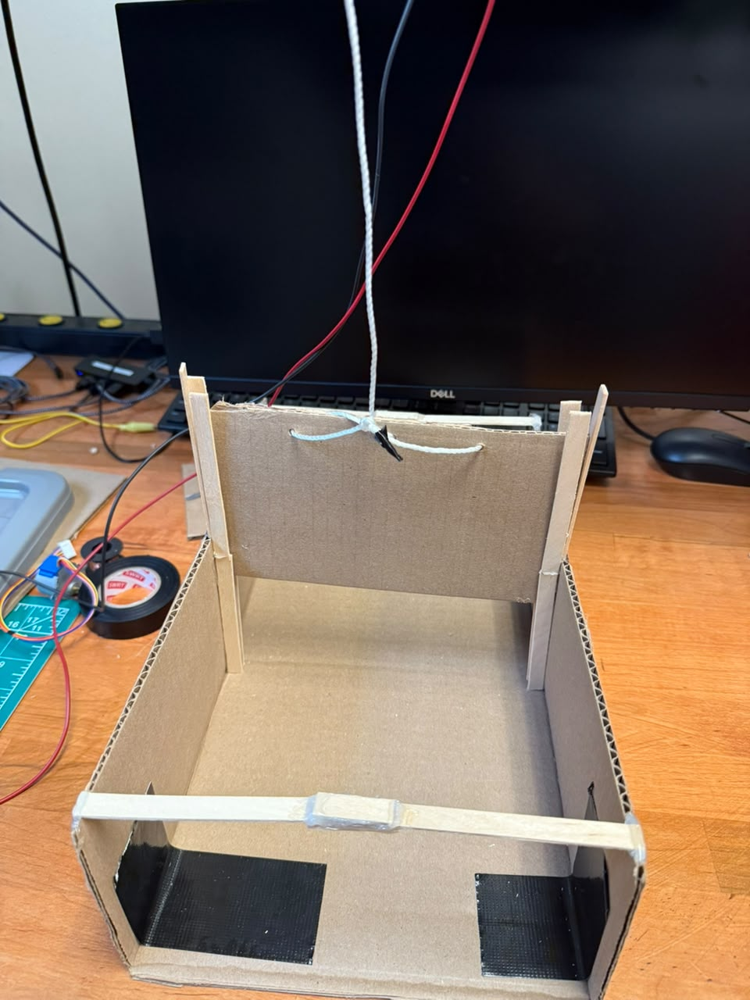
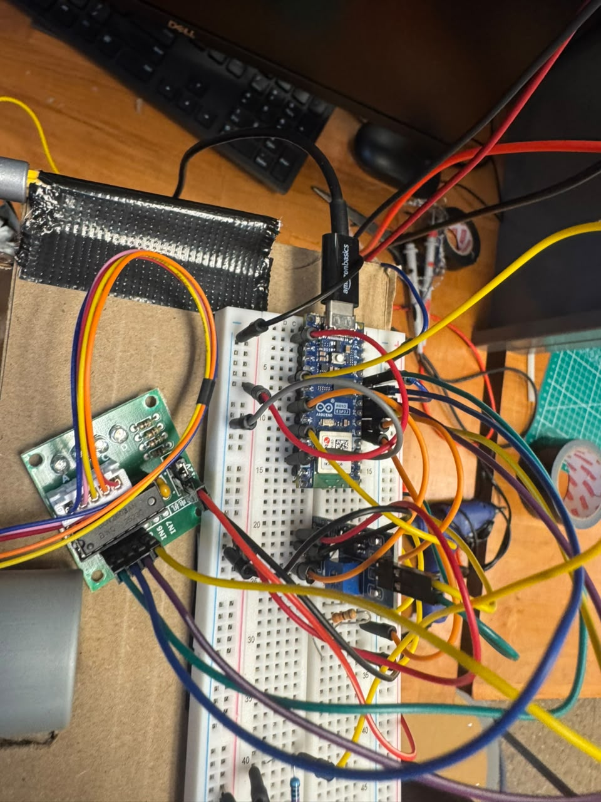
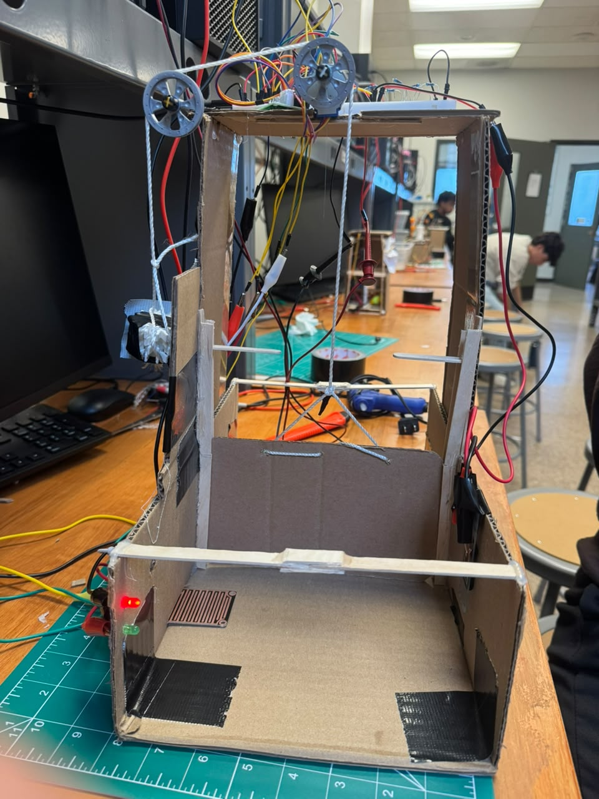

# Automatic Floodgate Prototype

## Team Members

- Diego Chuquillanqui
- Diane Ngo
- Artur Kis

## Project Overview

This project is a small-scale **automatic floodgate prototype** designed to detect unsafe moisture conditions and automatically close a barrier to help protect an area from flooding.

The system uses two different sensors:

- A homemade **PEDOT:PSS humidity sensor** fabricated during the Sensing the World module
- A commercial **rain sensor** for detecting direct contact with water

When either sensor detects an unsafe condition, a stepper motor moves the floodgate into the closed position. A red LED indicates a detected moisture condition, while a green LED indicates safe conditions. A pushbutton allows the user to manually reopen the gate after the rain sensor no longer detects water.



## Humanitarian Purpose

Flooding can damage homes, shelters, infrastructure, and important supplies. The goal of this prototype was to demonstrate how sensors and automated systems could be used to respond to rising moisture or water without requiring a person to manually close a barrier.

The PEDOT:PSS sensor provides an early response to increased humidity, while the rain sensor provides confirmation of direct water exposure.

## Main Components

- Arduino Nano ESP32 running MicroPython
- Homemade PEDOT:PSS humidity sensor
- Commercial rain sensor
- 28BYJ-48 stepper motor
- ULN2003 stepper motor driver
- Red LED
- Green LED
- Pushbutton
- Breadboard and jumper wires
- Resistors
- Sliding floodgate prototype
- String and pulley/spool mechanism

## Sensor System

### Homemade PEDOT:PSS Sensor

The homemade sensor was made using interdigitated Ag-paint electrodes on a glass slide with PEDOT:PSS deposited over the electrodes.

The electrical response of the PEDOT:PSS changes when exposed to humidity. The Arduino measures this response through an analog input and compares the current reading with a dry baseline established when the program begins.



### Commercial Rain Sensor

The commercial rain sensor is used to detect direct water exposure. Its analog output decreases as more water contacts the conductive surface.



Using both sensors allowed the prototype to respond to two different moisture conditions: increased humidity and direct contact with water.

## System Operation

The final system follows this sequence:

1. The system starts with the floodgate open and the green LED on.
2. The PEDOT:PSS sensor is calibrated to establish a dry baseline.
3. Both the PEDOT:PSS sensor and rain sensor are continuously monitored.
4. If either sensor detects an unsafe moisture condition:
   - The green LED turns off.
   - The red LED turns on.
   - The stepper motor closes the floodgate.
5. After the PEDOT:PSS sensor triggers, it is temporarily disarmed because the material can take a relatively long time to return to its original dry value.
6. When the rain sensor is dry, the user can press the reset button to reopen the gate.
7. The PEDOT:PSS sensor automatically becomes active again once its reading returns sufficiently close to its dry baseline.



## Mechanical System

The floodgate moves vertically along guide rails. String attached near both sides of the gate joins into a central lifting line.

The lifting line passes through the pulley system and is moved by a spool connected to the stepper motor. This arrangement allows the motor to raise and lower the gate while helping keep the gate approximately level.



### Gate Development

The gate structure was first constructed and tested separately before all of the sensors and electronics were mounted onto the prototype.



The electronics and sensors were also tested before being fully integrated into the physical floodgate structure.


## Electronics

The Arduino Nano ESP32 reads both sensors and the reset button, processes the sensor measurements, controls the LEDs, and sends the stepping sequence to the ULN2003 motor driver.

The ULN2003 driver provides the interface between the Arduino and the 28BYJ-48 stepper motor.



## Code Development

The project was developed by testing individual components before combining them into the final system.

### [01_stepper_motor_test.py](development/01_stepper_motor_test.py)

Tests the 28BYJ-48 stepper motor by rotating it in both directions.

This program was used to determine the correct:

- Motor pins
- Half-step sequence
- Rotation direction
- Motor speed

### [02_rain_sensor_test.py](development/02_rain_sensor_test.py)

Reads and displays the ADC value from the commercial rain sensor.

This allowed us to compare dry and wet readings and select an appropriate threshold for detecting water.

### [03_pedot_sensor_response_test.py](development/03_pedot_sensor_response_test.py)

Tests the homemade PEDOT:PSS sensor.

The program first establishes a dry baseline and then displays:

- Current ADC reading
- Difference from the baseline
- Percentage change from the baseline

This helped characterize how the fabricated sensor responded to humidity.

### [04_initial_floodgate_control.py](development/04_initial_floodgate_control.py)

The first major integrated version of the project.

It combines:

- PEDOT:PSS sensor
- Rain sensor
- Stepper motor
- Red and green LEDs
- Reset pushbutton

In this version, either sensor can trigger the floodgate to close.

### [05_pedot_delta_threshold_test.py](development/05_pedot_delta_threshold_test.py)

Tests an alternative method for detecting changes in the PEDOT:PSS sensor.

Instead of using percentage change as the trigger, this version uses the absolute difference between the current ADC value and the dry baseline.

This experiment helped compare different methods for determining when the homemade sensor should activate the floodgate.

## Final Code

### [automatic_floodgate_final.py](final/automatic_floodgate_final.py)

This is the final integrated MicroPython program used for the completed prototype.

The final version:

- Monitors both moisture sensors
- Calculates the PEDOT:PSS percentage change from its dry baseline
- Requires multiple readings before triggering to reduce false detections
- Automatically closes the floodgate
- Controls the red and green LEDs
- Allows the user to reset and reopen the gate
- Temporarily disarms the PEDOT:PSS sensor after activation because the sensor was observed to recover slowly after exposure to high humidity
- Automatically re-arms the PEDOT:PSS sensor once it returns sufficiently close to its dry baseline
- Includes a motor safety limit that stops the stepper if it runs for too long.

## Testing

The prototype was tested under several conditions:

- Both sensors dry
- Rain sensor exposed to water
- PEDOT:PSS sensor exposed to increased humidity
- Reset button pressed while water was still detected
- Reset button pressed after the rain sensor returned to dry conditions
- Multiple gate opening and closing cycles
- Stepper motor operation in both directions
- LED response during safe and unsafe conditions

A successful test required the correct LED indication and the expected gate response for each condition.

### Gate Open

Under safe conditions, the floodgate remains open and the green LED indicates that the system is in its normal state.


### Gate Closed

When an unsafe moisture condition is detected, the red LED activates and the motor moves the floodgate into its closed position.



## Engineering Iteration and Troubleshooting

Several changes were made throughout development as the sensors, electronics, software, and mechanical system were tested together.

### PEDOT:PSS Sensor

The fabricated PEDOT:PSS sensor produced a significant electrical response when exposed to humidity, but it was also observed to recover slowly after strong humidity exposure.

To account for this behavior, the final program temporarily disarms the PEDOT:PSS sensor after it triggers. The sensor can later re-arm once its reading returns close enough to its original dry baseline.

Different approaches were also tested for determining when the sensor should trigger the gate, including:

- Raw ADC difference from baseline
- Percentage change from baseline

Percentage change was ultimately used in the final control program.

### Rain Sensor

The commercial rain sensor produced high ADC readings when dry and lower readings when water contacted the conductive surface.

Testing was used to determine a threshold that could distinguish between dry and wet conditions.

### Stepper Motor and Pulley System

The stepper motor was initially tested independently before being connected to the gate.

During development, the following parameters were adjusted:

- Direction of rotation
- Number of motor steps
- Step delay
- String routing
- Pulley arrangement
- Gate guide rails

These changes were necessary to make the physical gate move more consistently.

## Project Files

```text
Project/
│
├── development/
│   ├── 01_stepper_motor_test.py
│   ├── 02_rain_sensor_test.py
│   ├── 03_pedot_sensor_response_test.py
│   ├── 04_initial_floodgate_control.py
│   └── 05_pedot_delta_threshold_test.py
│
├── final/
│   └── automatic_floodgate_final.py
│
├── images/
│   ├── control-electronics.jpeg
│   ├── electronics-and-sensor-prototype.jpeg
│   ├── floodgate-closed.jpeg
│   ├── floodgate-open.jpeg
│   ├── gate-mechanical-prototype.jpeg
│   ├── pedot-pss-sensor.jpeg
│   ├── rain-sensor.jpeg
│   ├── status-leds.jpeg
│   └── stepper-pulley-mechanism.jpeg
│
├── presentation/
│   └── FYRE Project Presentation.pdf
│
└── README.md
```

## Final Presentation

The presentation used to explain the project, design process, system operation, and results can be viewed here:

[**View Final Project Presentation**](presentation/FYRE%20Project%20Presentation.pdf)

## Final Result

The completed prototype demonstrates how material sensing, circuits, microcontrollers, programming, and mechanical design can be combined into an automated flood-response system.

The commercial rain sensor provides direct water detection, while the fabricated PEDOT:PSS sensor demonstrates how a material whose electrical properties respond to moisture can be incorporated into a larger embedded system.

The project also demonstrates the engineering design process through component testing, system integration, troubleshooting, iteration, and final prototype testing.

## AI Use

ChatGPT was used during the project to assist with:

- Organizing and troubleshooting MicroPython code
- Combining individually tested components into the complete system
- Comparing PEDOT:PSS threshold methods
- Troubleshooting stepper motor behavior
- Revising sensor control logic
- Organizing project documentation

The physical construction, wiring, testing, measurements, observations, and final design decisions were completed and evaluated by the project team.
